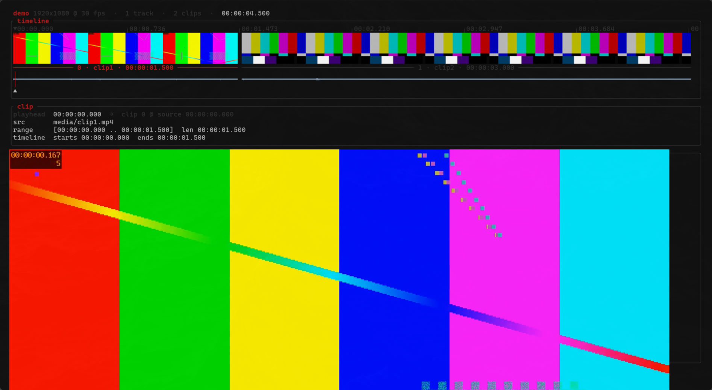
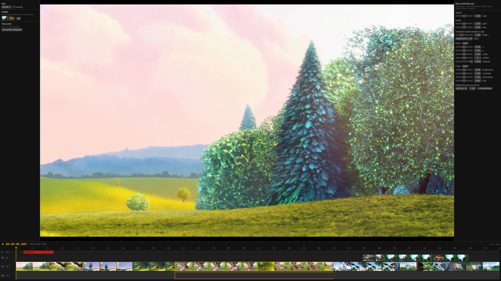

# Viode

[](https://github.com/edimoldovan/viode/actions/workflows/ci.yml)

## **The mission: get Lex Fridman off macOS/Windows.**

Ask anyone who's tried to leave Mac or Windows what's holding them back and
you'll hear the same answer: *"I would, but I edit video."* Premiere,
Final Cut, DaVinci — the last professional workloads with no serious home
on Linux. Lex edits a 3-hour podcast; today that means Apple hardware and
Adobe rent. The day he can cut an episode faster on Linux than on his Mac,
that excuse dies for everyone.

Viode is that editor, built Linux-first around three ideas:

- **Your edit is data you own.** The timeline is a plain text file: diff a
  cut, revert a mistake, review an edit like a pull request. No opaque
  project blobs, no cloud, no subscription.
- **The editor does the tedious work.** Remove dead air with one command.
  Sync multicam angles by their audio, no clap slate. Delete a sentence in
  the transcript and the video cuts itself. Export with correct loudness
  without knowing what LUFS means.
- **AI is a first-class editor, not a plugin.** Claude (or any
  [MCP](https://modelcontextprotocol.io) client) drives the same engine you
  do — full feature parity with the CLI: it can cut, trim, place, grade,
  *look at frames and scopes*, read waveforms, and render.

Today Viode ships a CLI, an MCP server, and a fast keyboard UI with real
filmstrips and inline playback. They are all thin clients over one engine
(`viode-core`) — a full graphical UI is a planned client of the same core,
not a rewrite.

## Where Viode already beats Premiere

|  | Premiere | Viode |
|---|---|---|
| Your edit | opaque `.prproj` blob | plain TOML — `git diff` a cut, `git revert` a mistake, review an edit like a PR |
| Remove dead air | click through a 3-hour timeline | `viode cut-silences 0` — one command, padding included |
| Edit by transcript | cloud-tethered, subscription-gated | whisper.cpp on your machine: delete the sentence, the video cuts itself |
| Multicam sync | import, create sequence, wait | `viode angle cam2.mp4` — audio cross-correlation, no clap slate |
| Automation | ExtendScript, mostly abandoned | every feature is a CLI verb; cron it, pipe it, script it |
| AI | none that matters | a first-class MCP client that can cut, trim, *look at frames*, read waveforms, and render |
| Loudness-correct exports | know the right LUFS, configure it | `viode render --preset podcast` — two-pass EBU R128 built in |

Every planned phase has shipped: playback (instant in-terminal AND live
composited), audio mixing, keyframes, transforms/PiP, color with scopes,
the full roll/slip/slide trim grammar, speed ramps with optical-flow
smoothing, ProRes/DNxHR/HEVC/AV1 exports with a render queue, and media
relinking. What remains is depth and dogfooding — and the table above is
the part they can't copy back.





*Filmstrips, waveforms, a playhead — and live video playback of the edit,
with zero rendering in between  — both in a TUI and a GUI.*

## Why

Editing is a feedback loop: look, cut, look again. Viode is built so that
loop has nothing in it that isn't editing — no waiting on renders to see a
cut (playback of your edit starts instantly), no clicking through hours of
footage to find dead air (one command), no re-syncing cameras by hand (the
audio does it), no guessing at loudness specs (presets know). And because
every capability is exposed as a command and an MCP tool, anything
repetitive can be scripted or delegated to an AI that works with the same
precision you do.

The acceptance test is written down and non-negotiable: **Lex edits a
3-hour multicam podcast in Viode, and it's *better* than his Mac setup.**
Every design decision gets judged against that bar — "works on a 3-minute
demo" is not done.


## Proven on real media

Not demo clips — real films, measured end-to-end on 2026-08-28.
Test bench: AMD Ryzen 9 9950X3D (16c/32t), 64 GB RAM, Radeon iGPU,
WD_BLACK SN8100 NVMe, Arch Linux (kernel 7.1.8). Media: His Girl Friday
(1940, 1h32m of the fastest dialogue ever filmed), Sita Sings the Blues
(CC, 1h22m), and an hour of genuine 4K60 (Big Buck Bunny, lossless-looped).
Protocol: [scripts/test-real-media.sh](scripts/test-real-media.sh).

| Real-world task | Time |
|---|---|
| Build a 2h53m two-film timeline | 0.4s |
| 50 splits across that 3-hour timeline | 0.15s (~3ms per edit) |
| Silence scan over 92 min of rapid dialogue | 8.6s (~640× realtime) |
| Proxy ~3h of footage (parallel per-file) | 77.8s (~135× realtime) |
| Multicam auto-sync on real 1940s audio | 4.0s — found the 2.000s offset **exactly** |
| Cut to the synced angle (`take`) | instant |
| Render an 80s composite (wipe + grade + 1.5× speed + PiP + title) | 4.9s |
| Loudness-normalized podcast export | 7.6s |
| ProRes interchange export | 10.2s |
| Scene detection on 10 min of 4K60 (via proxy) | 2.6s (was 52.2s on the original — 20×) |
| Repeat audio analysis (cached) | 0.01s |
| Probe a 1-hour 4K60 file | 2.4s |
| Proxy 1 hour of 4K60 | 6m21s (~10× realtime — within 1.4× of the raw decode floor) |
| Render 30s of true 3840×2160@60 | 17.8s (1.7× realtime) |

Two bugs no synthetic test had caught fell out of this session — a
transition-type render failure and renders silently ignoring project
resolution — both fixed with regression tests the same day. The
optimization backlog is measured, not guessed (VA-API proxying tested
**4.5× slower** than this CPU, so it stays opt-in).

### First run on macOS (2026-08-29)

Viode had never run on macOS before this. Test bench: Apple M5 Max,
128 GB unified memory, macOS 26, Homebrew GStreamer 1.28.6, Rust 1.98.

| What | Result |
|---|---|
| `cargo build --release` | clean on the first try (28s) |
| `cargo test` — the full suite, 69 tests | all green; warm end-to-end run ~3s |
| GES render, podcast preset, preview pipeline | all work, first try |

One genuine gap: Homebrew's monolithic gstreamer omits the soundtouch
plugin, so speed changes (`viode speed`) failed to render until we built
`libgstsoundtouch` from the matching gst-plugins-bad source (~1 minute)
and dropped it into `~/.local/share/gstreamer-1.0/plugins/`. Everything
else worked unmodified. Full log and fixes:
[docs/macos-bootstrap.md](docs/macos-bootstrap.md).

## Install

Requirements (Arch package names; any distro works with equivalents):

```
rust  ffmpeg  gstreamer  gst-editing-services  gst-plugins-{base,good,bad,ugly}  gst-libav
```

Optional: `gst-plugin-va` for hardware decode, `mpv` for TUI playback.

Transcription also needs a ggml model: drop one (e.g. `ggml-base.en.bin`
from huggingface.co/ggerganov/whisper.cpp) into
`~/.local/share/viode/models`, or point `VIODE_WHISPER_MODEL` at it.

After installing, run `viode doctor`: it checks every engine piece this
machine has (GStreamer elements, ffmpeg, mpv, whisper.cpp) and names the
exact package for anything missing. GStreamer builds differ per platform
— Homebrew's ships without soundtouch, for example — so the editor also
tells you upfront: the GUI shows a banner, the TUI status line points at
`viode doctor`, and the MCP server reports gaps to the AI when it
connects, before it plans an edit around a feature that isn't there.

```bash
git clone https://github.com/edimoldovan/viode && cd viode
cargo install --path crates/viode-cli
```

## Quickstart

```bash
viode new mycut && cd mycut
viode add ~/footage/interview.mp4     # copies into media/, appends to timeline
viode ls                              # show the timeline
viode split 0 12.5                    # split clip 0 at 12.5s into it
viode rm 1                            # drop the second piece
viode render                          # frame-accurate render -> renders/mycut.mp4
```

Or skip the typing:

```bash
viode tui
```

## The keyboard UI

`viode tui` opens the timeline (shown above). There is no mouse and no
separate selection: **the playhead is the selection** — move it, then act
on the clip under it.

In kitty/ghostty (Omarchy's terminals) the TUI draws **real video
thumbnails** above the clip lane and **audio waveforms** below it via the
kitty graphics protocol — generated in the background (proxy-aware, cached
in `cache/tui/`), so the UI never blocks. Everywhere else it falls back to
pure text automatically (`VIODE_NO_GRAPHICS=1` forces the fallback). All
colors are named ANSI, so the TUI inherits whatever theme your terminal —
and therefore aether/Omarchy — is running.

| Keys | Action |
|---|---|
| `h` `l` / `H` `L` | move playhead ±0.1s / ±1s |
| `j` `k` | jump to next / previous clip edge |
| `s` | split clip at playhead |
| `i` `o` | trim clip start / end to playhead |
| `d` | delete clip |
| `<` `>` | move clip left / right in the sequence |
| `u` `U` | undo / redo |
| `space` | play the timeline INLINE from the playhead (instant, cuts-only) / pause |
| `x` | stop playback |
| `v` | LIVE composited preview in a window — no render step |
| `P` | render the composite, then play it inline |
| `r` | render the master |
| `w` / `q` / `?` | save / quit (confirms if unsaved) / help |

The `? help` chip on the right of the status line stays visible at all
times; in the GUI, the same reference sits behind the `?  Help` button
in the timeline header (or press `?`).

## The GUI viewer

`viode gui` opens the current directory's project; `viode gui <path>`
opens a project file or directory from anywhere. Started with neither —
which is what launching Viode from the app menu looks like — it shows a
welcome screen instead: recent projects, New Project (name, fps,
resolution, location), and an Open Project file dialog. Every project
you open lands in the recents list automatically, however you opened it.

To put Viode in your app launcher and associate `.viode` project files
with it before packages exist, run `./scripts/install-desktop.sh` (it
installs the icon, launcher entry, and file association into
`~/.local/share`; `--uninstall` removes them). The packages will install
the same files system-wide.

The window itself (egui) is laid out like an
NLE: the preview dominates, and the timeline docks below it with a
prominent timecode, track headers on the left (V1/A1 style; video lanes
stack above V1, audio lanes below A1), real filmstrips and waveforms, and
titles as markers. Colors follow the Omarchy theme — the GUI reads the
same terminal palette the TUI inherits, so it matches your desktop (and
falls back to a neutral dark theme elsewhere). The preview is the
same GES timeline the renderer uses, streamed frame-by-frame into the
window, so transitions, titles, transforms, and keyframes all play exactly
as they will render. Transport follows the editor grammar: `space`
play/pause, `J`/`K`/`L` shuttle (up to 8x, both directions), `←`/`→` seek,
`,`/`.` frame-step, `home`/`end` jump, and clicking or dragging on the
timeline scrubs. 4K projects preview at 720p automatically; sources stay
untouched.

The GUI edits with full parity (G2): click a clip to select it, drag it
to move (main-track clips reorder, overlays reposition), drag its edges
to trim, `alt`+drag an edge to roll the cut, `alt`+drag the body to
slip, `shift+alt`+drag to slide. The keyboard grammar carries over from
the TUI: `s` split, `i`/`o` trim to playhead, `d` delete, `<`/`>` move,
`t` title, `u`/`U` undo/redo, `w` save (quit asks about unsaved edits).
An inspector panel edits every clip property from Phases 5-7 — speed,
gain, pan, fades and wipes, position/scale/rotate/opacity, color grade,
keyframes — plus full title editing. Edits rebuild the live preview in
place, debounced, with single undo steps per slider gesture.

The viewer also live-reloads: when any other process rewrites the
project file — the CLI, an editor, or an AI session over MCP — the
timeline redraws and the preview rebuilds in place (unsaved local edits
are never clobbered). Ask Claude to *"open the UI"* over MCP
(`ui_open`) and watch the edit happen.

The pro surface (G3) lives in the left panel. Angles: every non-main
track appears with a thumbnail — mark a range (`[` and `]`, shown on
the ruler) and click an angle to take that range from it, the multicam
cut as one click. Transcript: transcribe the clip under the playhead
(whisper.cpp), then click a sentence to jump to it or ✕ to cut it out
of the video. Scopes: a toggle overlays waveform + vectorscope QC
images on the paused preview frame. The render dialog (`r`) does
masters, YouTube/Shorts/podcast presets and custom codecs, renders in
the background, and manages the shared render queue. Missing media
raises a relink banner — point it at a directory and clips reconnect
by filename.

## CLI reference

```
viode new <name> [--fps 30] [--res 1920x1080]   create a project directory
viode add <file> [--in T] [--out T]             append a clip (imports if outside)
viode import <files...>                         copy media into media/
viode probe <file>                              media metadata
viode ls                                        show the timeline
viode split <i> <at>                            split clip i at offset
viode trim <i> [--in T] [--out T]               change source in/out points
viode move <from> <to>                          reorder clips
viode rm <i>                                    remove a clip
viode fade <i> <dur>                            crossfade with previous clip (0 clears)
viode gain <i> <vol>                            audio gain (linear, 1.0 = unity)
viode pan <i> <p>                               stereo pan, -1..1
viode key <i> <volume|alpha> <at> <val>         keyframe (ducking, fades, opacity)
viode keys <i> [--rm k]                         list / remove keyframes
viode fx <i> "<gst effect>" [--track N]         add effect, e.g. "videobalance saturation=0"
viode track add <name> [--kind video|audio]     overlay tracks (B-roll, music)
viode track ls / on <i> / off <i>               manage tracks
viode add <file> --track N --at T               place a clip on an overlay track
viode title "text" --at T --dur D [--font F]    overlay a title
viode titles [--rm k]                           list / remove titles
viode sync <a> <b>                              audio-sync offset between two files
viode angle <file>                              add a synced multicam angle (disabled track)
viode take <track> <start> <end>                cut to an angle for a timeline range
viode transcribe <i> [--model M]                whisper.cpp transcript (timed segments)
viode cut-text <i> <from> <to>                  cut transcript segments out of the video
viode place <i> --x --y --scale --opacity       picture-in-picture, layouts, rotation
viode color <i> --saturation ... [--lut f.cube] color grade / LUT
viode scope <i> [--kind waveform|vector]        colorist's instruments (PNG)
viode speed <i> <rate>                          2 = fast, 0.5 = slow motion
viode roll/slip/slide <i> <±sec>                pro trim grammar (totals preserved)
viode play [--from T]                           LIVE composited preview, no render
viode queue add/ls/run/clear                    render queue
viode media ls/missing · viode relink <dir>     media management, reconnect moved files
viode bench <file>                              measure sw vs hw encoding on YOUR footage
viode doctor                                    engine checkup: what works on THIS machine
viode silences <i>                              list silent stretches
viode cut-silences <i> [--pad 0.15]             cut dead air (keeps padding)
viode scenes <i> / split-scenes <i>             scene changes / split at them
viode levels <i> [--window 0.5]                 RMS loudness map
viode waveform <i> / thumbs <i>                 waveform PNG / contact sheet PNG
viode proxy [--force]                           build 540p proxies for all media
viode render [--preset P] [--codec C]           presets or h264/hevc/av1/prores/dnxhr
             [--bitrate kbps] [--smooth fps]    bitrate targeting, optical-flow slow-mo
viode tui                                       terminal UI
viode gui                                       GUI viewer: live preview + timeline
viode serve --mcp                               MCP server on stdio
```

Times accept `12`, `12.5`, `01:30`, or `00:01:30.250` everywhere.

`--smart` renders by lossless stream-copy in ~0 time (cuts snap to
keyframes). Hardware encoding is opt-in and honest: run `viode bench` on
your own footage — the hardware candidate is VA-API on Linux and
VideoToolbox on macOS, and if it wins on your machine the verdict prints
the exact `VIODE_HWACCEL` value to export, which switches proxies and
renders over; the default never changes without a local measurement. `--preset` finishes the master for a destination with two-pass
EBU R128 loudness: `youtube` (-14 LUFS), `shorts` (1080x1920 center-crop,
-14 LUFS), `podcast` (audio-only m4a, -16 LUFS).

## The project file

A project is a directory; the timeline is `project.viode` — plain TOML,
hand-editable, git-diffable. Track 0 is the main sequence: clips play
back-to-back in file order, positions derived, never stored (an optional
`transition` crossfades with the previous clip). Overlay tracks position
clips explicitly with `at`; titles sit on top. Old single-track files load
forever.

```toml
[project]
name = "mycut"
fps = 30.0
resolution = [1920, 1080]

[[track]]
name = "main"

[[track.clip]]
src = "media/interview.mp4"
in = "00:00:04.200"    # where playback starts in the source file
out = "00:01:12.000"   # where it ends

[[track.clip]]
src = "media/broll.mp4"
out = 2.5              # numbers or timecodes; `in` defaults to 0
transition = 0.5       # crossfade with the previous clip
effects = ["videobalance saturation=0.0"]

[[track]]
name = "music"
kind = "audio"         # av (default) | video | audio

[[track.clip]]
src = "media/theme.mp3"
out = 30.0
at = 0.0               # overlay tracks are positioned explicitly

[[title]]
text = "Chapter One"
at = 1.0
dur = 3.0
```

## Multicam

Angles sync themselves by audio cross-correlation — no clap slate, no
manual nudging:

```bash
viode add cam1.mp4          # the reference
viode angle cam2.mp4        # synced automatically, parked as a disabled track
viode take 1 05:00 07:30    # cut to cam2 for that timeline range
```

`take` swaps the synced angle footage onto the main track; total duration
never changes.

## Edit video by editing text

```bash
viode transcribe 0          # whisper.cpp -> numbered, timed segments
viode cut-text 0 12 14      # delete segments 12-14 -> the video cuts itself
```

Requires whisper.cpp (`pacman -S whisper.cpp`) and a ggml model
(`VIODE_WHISPER_MODEL` or `--model`).

## AI editing over MCP

`viode serve --mcp` speaks MCP on stdio. Register it with your client (for
Claude Code, this repo ships [.mcp.json](.mcp.json)) and the AI gets every
CLI verb as a tool, plus senses:

- `frame_grab` — returns the frame at any timeline position as an image
  (overlay-aware), so the model can *look at* a cut before judging it
- `thumbs` / `waveform` — contact sheets and waveform images
- `audio_levels`, `silence_detect` / `silence_cut`, `scene_detect` /
  `scene_split`
- `render_preview` — fast sub-range render for checking a section
- the full edit surface: tracks, effects, fades, titles, multicam
  (`angle_add` / `take`), and transcripts (`transcribe` / `text_cut`)
- `ui_open` — opens the GUI on the user's screen; it live-reloads on
  every MCP edit, so the user watches the AI cut in real time ("open the
  UI" always means the GUI; `tui_open` exists for explicit TUI requests)

A realistic prompt: *"Create a project from the clips in ~/footage, open
the UI, cut the silences out of clip 0, and render a shorts version"* —
and the edit assembles itself in the window while the model works.

## Architecture

```
   viode CLI ───►┌────────────┐
   viode tui ───►│ viode-core │──► GES/GStreamer (frame-accurate render)
   viode gui ───►│  (library) │──► ffmpeg sidecar (probe, proxies, analysis,
 MCP (Claude)───►└────────────┘     smart-copy, presets)
```

- **viode-core** — timeline model, TOML persistence, pure edit operations,
  analysis, render backends. Every client goes through it; the GUI is just
  another client and adds zero capabilities the CLI lacks.
- **GStreamer Editing Services** renders; **ffmpeg** does everything around
  the timeline. The engine sits behind a trait and is swappable.
- Proxies (540p) are built once and used automatically by playback,
  previews, frame grabs, and contact sheets.

## Status

| Phase | | |
|---|---|---|
| 0 | Engine spike (Rust + GES) | ✅ |
| 1 | Cuts-only editor: model, TOML, CLI, dual render paths | ✅ |
| 2 | MCP server with visual senses | ✅ |
| 3 | Silence/scene detection, proxies, waveforms, export presets | ✅ |
| 4 | The TUI | ✅ |
| 5 | Multi-track, multicam, transcripts, effects & titles | ✅ |
| 6 | Daily-driver gap: live playback, audio control, keyframes | ✅ |
| 7 | Pro-work gap: transforms, color+scopes, trim grammar, speed, export breadth, live preview | ✅ |
| 8 | The GUI (egui) — G1 viewer ✅, G2 editing parity ✅, G3 pro surface (multicam takes, transcript editing, scopes, render dialog, relink) ✅, next: G4 macOS | ⏳ |

## Development

```bash
cargo build && cargo test          # 114 tests: unit, property-based, end-to-end
./scripts/bench-longform.sh 10     # long-form performance check
```

On 5-minute 720p footage: edit ops ~3 ms, full silence scan 0.8 s, proxy
build ~60x realtime. Long footage is proxied once, then everything
interactive touches only proxies.

Tests generate their own media with ffmpeg and self-skip on machines
without ffmpeg/GES. Read `crates/viode-cli/tests/cli.rs`
(`full_edit_workflow`) for the product walkthrough in test form, and
`crates/viode-cli/tests/mcp.rs` for a worked MCP session.
